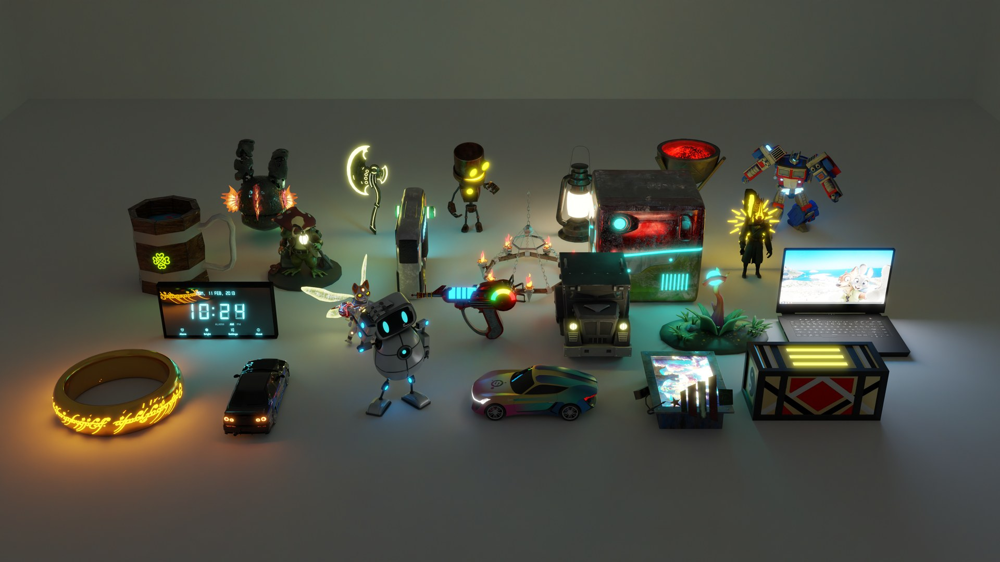

# LightGenBench: A Benchmark for 3D Emission Generation



[Dongchen Yang](https://www.sfu.ca/~dya78/), [Xingguang Yan](https://yanxg.art/), [Manolis Savva](https://msavva.github.io/) \
Simon Fraser University

[](https://3dlg-hcvc.github.io/lightgenbench/)
[](#)
[](https://huggingface.co/datasets/3dlg-hcvc/LightgenBench)

LightGenBench is a benchmark for emission generation.
We curate a [dataset](#dataset) of 36,826 artist-made emissive assets in 105 categories from [TexVerse](https://huggingface.co/datasets/YiboZhang2001/TexVerse), and evaluate [baselines](#baselines) from four method families: UV-domain, sparse-voxel, multi-view, and segmentation-based generation.


## Environment Setup
Coming soon.


## Dataset
The dataset is on [Hugging Face](https://huggingface.co/datasets/3dlg-hcvc/LightgenBench).
Request access on that page (it is granted right away), then download and unpack it:
```bash
hf auth login
hf download 3dlg-hcvc/LightgenBench --repo-type dataset --local-dir lightgenbench
cd lightgenbench && for t in data/*/*/*.tar; do tar -xf "$t"; done
```


## Baselines
| Baseline | Method family | Built on |
|---|---|---|
| TEXGen-Emission | UV-domain | [TEXGen](https://github.com/CVMI-Lab/TEXGen) |
| TRELLIS.2-Emission | sparse-voxel | [TRELLIS.2](https://github.com/microsoft/TRELLIS.2) |
| Hunyuan3D-Emission | multi-view | [Hunyuan3D-2.1](https://github.com/Tencent-Hunyuan/Hunyuan3D-2.1) |
| SegviGen-Emission | segmentation-based (on voxels) | [SegviGen](https://github.com/Nelipot-Lee/SegviGen) |

Code and checkpoints: coming soon.


## Evaluation
The validation split is used for model selection and the test set for the reported numbers.
We sample 50,000 points on each asset's surface and report IoU for the emissive mask, and MAE and PSNR on the emissive color, averaged over five random seeds.
Code: coming soon.
<!-- TODO(code release): the evaluation samples points on the TexVerse GLBs, which the dataset does not include; say how to get them. -->


## Citation
```
@inproceedings{lightgenbench2026,
  title  = {LightGenBench: A Benchmark for 3D Emission Generation},
  author = {Yang, Dongchen and Yan, Xingguang and Savva, Manolis},
  year   = {2026}
}
```
LightGenBench is built on [TexVerse](https://huggingface.co/datasets/YiboZhang2001/TexVerse), so please cite it as well.
Every shape keeps the license of its source Sketchfab model; `metadata.parquet` lists the license, author and source URL of each.


## Acknowledgements
To be added.
